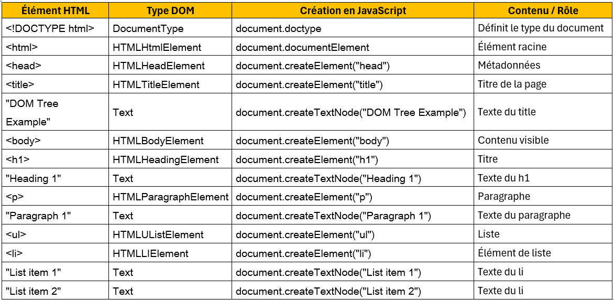

# 📌 Le DOM en JavaScript (Document Object Model)

## 1️⃣ C’est quoi le DOM ?

**DOM = Document Object Model**

Le DOM est une **représentation de la page HTML sous forme d’objets JavaScript**.  
Il permet à JavaScript de :
- lire le HTML
- modifier le contenu
- changer le style (CSS)
- ajouter / supprimer des éléments
- réagir aux actions de l’utilisateur

👉 **Le DOM est le lien entre le HTML et JavaScript**

---

## 2️⃣ Comment le navigateur voit le HTML

### HTML
```html
<!DOCTYPE html>
<html>
  <body>
    <h1>Bonjour</h1>
    <p>Bienvenue</p>
  </body>
</html>

Structure DOM (arbre)
document
 └── html
     └── body
         ├── h1
         │   └── "Bonjour"
         └── p
             └── "Bienvenue"


Chaque balise HTML devient un objet JavaScript.

3️⃣ L’objet document

Tout commence avec l’objet global :

document


Exemples :

document.title   // titre de la page
document.body    // <body>
document.head    // <head>

4️⃣ Sélectionner des éléments du DOM
📍 Par ID
<h1 id="titre">Salut</h1>

const titre = document.getElementById("titre");

📍 Par classe
<p class="text">Hello</p>
<p class="text">World</p>

const textes = document.getElementsByClassName("text");

📍 Par sélecteur CSS (le plus utilisé)
document.querySelector("p");        // premier <p>
document.querySelector(".text");    // première classe .text
document.querySelector("#titre");   // id titre
document.querySelectorAll("p");     // tous les <p>

5️⃣ Modifier le contenu HTML
✏️ Modifier le texte
titre.textContent = "Nouveau titre";

✏️ Modifier le HTML
titre.innerHTML = "<span>Salut 😎</span>";


⚠️ innerHTML peut poser des problèmes de sécurité si mal utilisé.

6️⃣ Modifier le style (CSS)
🎨 Style direct
titre.style.color = "red";
titre.style.fontSize = "40px";

🎨 Avec des classes CSS
titre.classList.add("important");
titre.classList.remove("important");
titre.classList.toggle("important");

7️⃣ Gérer les événements
Exemple : clic sur un bouton
<button id="btn">Clique-moi</button>

const btn = document.getElementById("btn");

btn.addEventListener("click", () => {
  alert("Bouton cliqué !");
});


Les événements permettent de rendre la page interactive.

8️⃣ Créer et supprimer des éléments
➕ Créer un élément
const p = document.createElement("p");
p.textContent = "Nouveau paragraphe";

document.body.appendChild(p);

❌ Supprimer un élément
p.remove();

9️⃣ Exemple complet
HTML
<button id="add">Ajouter</button>
<ul id="list"></ul>

JavaScript
const btn = document.getElementById("add");
const list = document.getElementById("list");

btn.addEventListener("click", () => {
  const li = document.createElement("li");
  li.textContent = "Nouvel élément";
  list.appendChild(li);
});


👉 À chaque clic, un nouvel élément est ajouté à la liste.

🔟 À quoi sert le DOM ?

Rendre une page interactive

Modifier le contenu sans recharger la page

Réagir aux actions de l’utilisateur

Base des frameworks modernes (React, Vue, Angular)

🧠 À retenir

Le DOM permet à JavaScript de manipuler le HTML comme des objets.


